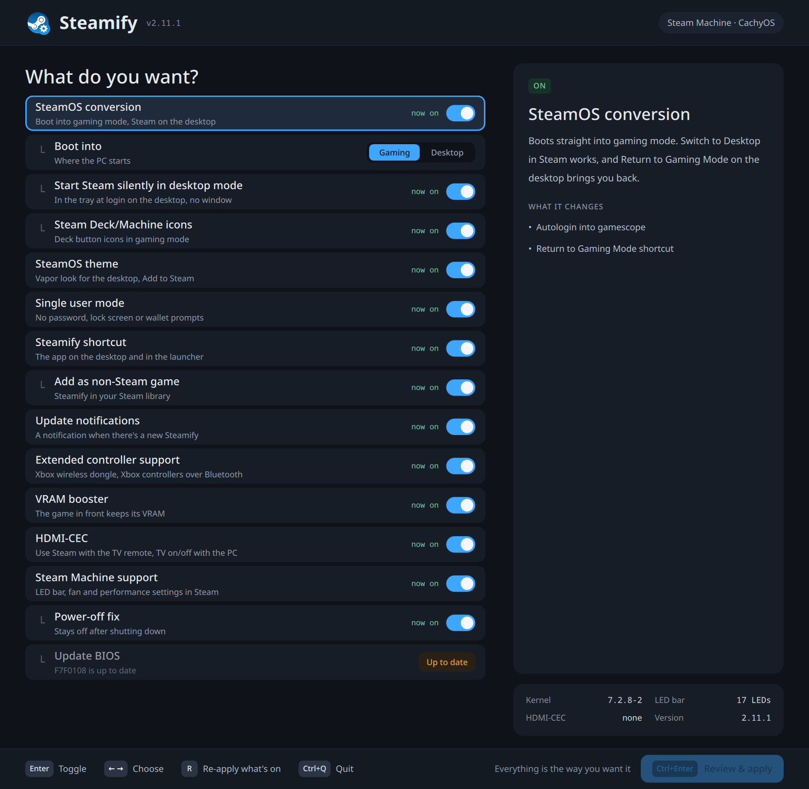
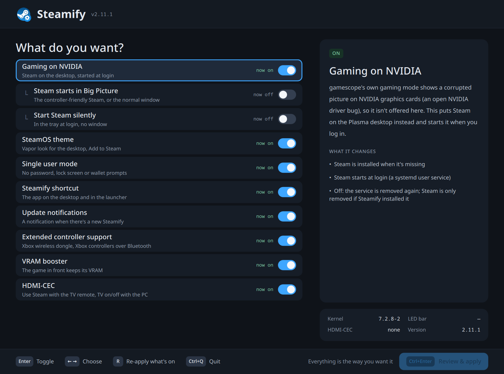

# Steamify CachyOS

The Steamify app's menu. On a Steam Machine (or any PC with an AMD or Intel
graphics card) it offers the full SteamOS conversion, on the left. On a PC with
an NVIDIA graphics card gamescope's gaming mode shows a corrupted picture, so the
menu offers **Gaming on NVIDIA** instead (Steam on the desktop, started at login,
optionally in Big Picture), on the right.

| On a Steam Machine | On a PC with an NVIDIA graphics card |
|---|---|
|  |  |

Turn a CachyOS desktop PC into a SteamOS-style console: it boots straight
into Steam's Big Picture (gamescope), and you can switch to the KDE Plasma
desktop and back whenever you like - just like on a Steam Deck or Valve's
Steam Machine.

- **One command**, then a simple checklist: pick what you want.
- **Everything is undoable**: untick something and it's put back the way it was.
- **Made for the Steam Machine**, and works on any CachyOS KDE desktop PC.

## What you get

1. **SteamOS conversion** - boots straight into gaming mode. **Switch to
   Desktop** in Steam works, and so does going back (the **Return to Gaming
   Mode** icon on the desktop). Steam's on-screen keyboard (Steam + X) works
   on the desktop too.
   - **Boot into: gamescope / desktop** - where the PC starts. Gaming mode is
     the default.
   - **Start Steam silently in desktop mode** (off by default) - Steam starts
     at login on the desktop, in the tray without a window. It is Steam's own
     autostart entry, so Steam's setting "Run Steam when my computer starts"
     follows it (the Linux Steam client has no silent option of its own).
   - Steam's **System** settings show the SteamOS release Steamify follows
     as OS Version (e.g. `steamos-3.9`), `steam-machine` as OS Codename and
     Steamify's version as OS Variant. The OS name stays CachyOS
     ([details](TECHNICAL.md#what-steams-system-settings-show)).
   - **NVIDIA graphics cards:** gamescope's gaming mode shows a corrupted
     picture there (an open NVIDIA driver bug), so the conversion isn't
     offered. **Gaming on NVIDIA** takes its place: Steam on the desktop,
     installed if it's missing and started at login, in **Big Picture** or its
     normal window as you choose
     ([details](TECHNICAL.md#gaming-on-nvidia)).
2. **SteamOS theme** - the Vapor look of SteamOS for the desktop, with
   **Add to Steam** in right-click menus
   ([details](TECHNICAL.md#steamos-desktop-look)).
3. **Steam Deck/Machine icons** - Steam Deck button icons in gaming mode (an option of the SteamOS conversion).
4. **Single user mode** - like SteamOS: never a login or lock screen, and no
   KDE wallet password prompts (e.g. from Brave). Typing a password with a
   controller is no fun
   ([details](TECHNICAL.md#single-user-mode-sddm-no-locking)).
5. **Steamify shortcut** - "Steamify CachyOS" on the desktop and in the
   launcher opens the newest Steamify app, so you don't need the install
   command again. "Steamify Terminal" in the launcher opens the terminal menu.
   With **Add as non-Steam game** (on by default) it's in your Steam library
   too: started from Steam it gets your controller (a Steam Controller only
   talks to Steam), in gaming mode as well. Steam closes for a moment while
   it's added, so that's done from the desktop. Not offered on PCs with an NVIDIA graphics card, which have no gaming mode.
6. **Update notifications** - on by default: a notification and a tray icon
   when there's a new Steamify, with Open Steamify and Skip this version. It
   never updates anything by itself
   ([details](TECHNICAL.md#update-notifications)).
7. **VRAM booster** - on by default: the game you're playing keeps its video
   memory and background apps make room, like SteamOS 3.9. Shown for GPUs
   whose driver supports it (AMD, Intel, NVIDIA with its open kernel modules
   from driver 615) on kernel 7.2 or newer. With NVIDIA's closed driver it's
   greyed out and says what to do: switch to the open driver when your card
   supports it (RTX 20 series and newer; Steamify shows the command, it
   doesn't switch drivers itself)
   ([details](TECHNICAL.md#vram-booster)).
8. **HDMI-CEC** (experimental; off by default, on by default on a Steam
   Machine) - use Steam with your TV's
   remote, and the TV turns on and off with the PC. Needs a PC with CEC (like
   the Steam Machine) or a USB CEC adapter; most graphics cards, NVIDIA
   included, don't have it. See [CEC.md](CEC.md) for which PCs do, and how to
   add it to your own build ([details](TECHNICAL.md#hdmi-cec)).
9. **Extended controller support** (off by default) - the Xbox wireless
   dongle (xone) and Xbox controllers over Bluetooth with rumble, the right
   button mapping and the battery level (xpadneo). Both are installed from the
   CachyOS repo and built for every installed kernel
   ([details](TECHNICAL.md#extended-controller-support)).

## Steam Machine

What Steamify can do on a Valve Steam Machine:

- **HDMI-CEC** - ticked by default here, as on SteamOS: use Steam with your
  TV's remote, and the TV turns on and off with the Steam Machine
  ([details](TECHNICAL.md#hdmi-cec)).
- **Steam Machine support** - the front **LED bar** works, Steam's
  **hardware settings** (fan, performance) work, and the power button puts
  it to sleep like a console. Steam's System settings show the serial
  number, and Steam's **Wi-Fi backend** setting works.
  - **Power-off fix** - on by default: shutting down really turns the Steam
    Machine off, also with the newest CachyOS kernel
    ([details](TECHNICAL.md#power-off-fix-steam-machine)).
  - **Update BIOS** - installs Valve's newest Steam Machine BIOS. Never ticked
    by default, at your own risk, and only after two warnings
    ([details](TECHNICAL.md#bios-updates-steam-machine)).

## Requirements

- CachyOS with the KDE Plasma desktop (the default CachyOS Desktop edition)

> **KDE Plasma only.** Steamify works with KDE Plasma and its login managers
> (plasma-login-manager or SDDM). Other desktops (GNOME, Hyprland, Cosmic,
> ...) and other display managers are not supported: the switching between gaming mode
> and the desktop, the theme and the shortcuts are all built for Plasma.
- Your normal user account, with permission to use `sudo`

## Installation

Open **Konsole** on your Plasma desktop and run:

```bash
curl -fsSL https://github.com/theupriser/steamify-cachyos/releases/latest/download/steamify.sh | bash
```

Installing CachyOS on a Steam Machine? The
[Steamify CachyOS ISO](https://github.com/theupriser/steamify-cachyos-live-iso)
has Steamify built into the installer: pick the options there, and the
first boot is already set up.

Prefer to look at the script first? Clone the repository and run
[`./steamify.sh`](steamify.sh) (keep the whole folder: it needs
[`lib/`](lib/)).

You'll see a checklist:

```
   [x] SteamOS conversion: boot into gaming mode, Steam on the desktop  (now: off)
         └ Boot into: [gamescope]  desktop
 > [x] Install SteamOS theme: Vapor look (cachyos-vapor)  (now: off)
   [x] Install Steam Deck/Machine icons: Deck button icons in gaming mode  (now: off)
   [x] Single user mode: no password, lock screen or log out (SDDM)  (now: off)
   [x] Steamify shortcut: desktop icon to run this again  (now: off)

  Up/Down move   Space select   Left/Right choose   Enter run
  a run + re-apply what's on   q quit
```

Tick with **Space**, run with **Enter**. It shows what it will change, asks
your password once, and offers to restart at the end. Below the list you see
every installed kernel, so after an update it's easy to check that
everything is in place.

Run it again whenever you like: to change your choices, or after a CachyOS
update (press `a` to re-apply what's on).

## Using it

- **To the desktop:** in gaming mode, open the Steam menu and choose
  **Power > Switch to Desktop**.
- **Back to gaming mode:** double-click **Return to Gaming Mode** on the
  desktop.
- **Remove it all:** run the wizard and untick everything. You get the
  normal CachyOS login screen back; Steam stays installed.

Prefer to start where you left off last time?

```bash
steamos-session-select persistent  # start where you left off last time
steamos-session-select oneshot     # always start in gaming mode (default)
```

Where the PC starts after a restart can also be set from a script, once the
SteamOS conversion is on (only that changes; `sudo` may ask for your password):

```bash
steamify.sh --boot desktop     # start in the desktop from the next boot on
steamify.sh --boot gamescope   # start in gaming mode again (default)
```

## Something wrong?

Stuck on a black screen in gaming mode: press **Ctrl+Alt+F3**, log in, and run

```bash
sudo /usr/lib/steamos/steam-set-session plasma.desktop && sudo systemctl restart display-manager
```

More in [TROUBLESHOOTING.md](TROUBLESHOOTING.md). How it all works:
[TECHNICAL.md](TECHNICAL.md). Changes per version: [CHANGELOG.md](CHANGELOG.md).
Contributing (or an AI agent)? Read [AGENTS.md](AGENTS.md).

## License

MIT - do whatever you want with it. See [LICENSE.md](LICENSE.md).

## Disclaimer

Steamify CachyOS is an unofficial community project. It is not affiliated
with, endorsed by, or sponsored by Valve Corporation or the CachyOS project.
Steam, SteamOS and the Steam logo are trademarks of Valve Corporation. CachyOS
is the name of its respective project. They are used here only to describe
what this script works with.
