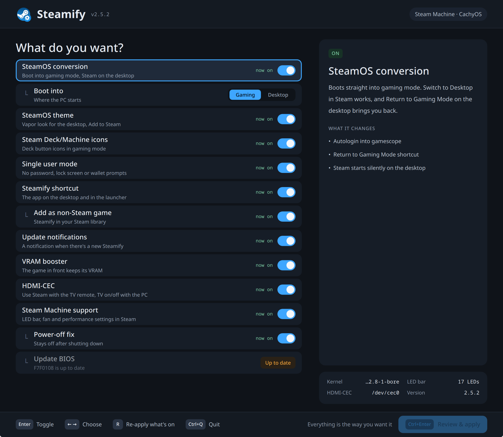

# Steamify CachyOS



Turn a CachyOS desktop PC into a SteamOS-style console: it boots straight
into Steam's Big Picture (gamescope), and you can switch to the KDE Plasma
desktop and back whenever you like - just like on a Steam Deck or Valve's
Steam Machine.

- **One command**, then a simple checklist: pick what you want.
- **Everything is undoable**: untick something and it's put back the way it was.
- **Made for the Steam Machine**, and works on any CachyOS KDE desktop PC.

## What you get

1. **SteamOS conversion** - boots straight into gaming mode. **Switch to
   Desktop** in Steam works, and so does going back (the **Return to Gaming
   Mode** icon on the desktop). Steam's on-screen keyboard (Steam + X) works
   on the desktop too.
   - **Boot into: gamescope / desktop** - where the PC starts. Gaming mode is
     the default.
2. **SteamOS theme** - the Vapor look of SteamOS for the desktop, with
   **Add to Steam** in right-click menus
   ([details](TECHNICAL.md#steamos-desktop-look)).
3. **Steam Deck/Machine icons** - Steam Deck button icons in gaming mode.
4. **Single user mode** - like SteamOS: never a login or lock screen, and no
   KDE wallet password prompts (e.g. from Brave). Typing a password with a
   controller is no fun
   ([details](TECHNICAL.md#single-user-mode-sddm-no-locking)).
5. **Steamify shortcut** - "Steamify CachyOS" on the desktop and in the
   launcher opens the newest Steamify app, so you don't need the install
   command again. "Steamify Terminal" in the launcher opens the terminal menu.
6. **Update notifications** - on by default: a notification and a tray icon
   when there's a new Steamify, with Open Steamify and Skip this version. It
   never updates anything by itself
   ([details](TECHNICAL.md#update-notifications)).
7. **VRAM booster** - on by default: the game you're playing keeps its video
   memory and background apps make room, like SteamOS 3.9. Shown for GPUs
   whose driver supports it (AMD, Intel) on kernel 7.2 or newer; greyed out
   with an NVIDIA card until NVIDIA's driver supports it
   ([details](TECHNICAL.md#vram-booster)).
8. **HDMI-CEC** (experimental; off by default, on by default on a Steam
   Machine) - use Steam with your TV's
   remote, and the TV turns on and off with the PC. Needs a PC with CEC (like
   the Steam Machine) or a USB CEC adapter; most graphics cards, NVIDIA
   included, don't have it. See [CEC.md](CEC.md) for which PCs do, and how to
   add it to your own build ([details](TECHNICAL.md#hdmi-cec)).

## Steam Machine

What Steamify can do on a Valve Steam Machine:

- **HDMI-CEC** - ticked by default here, as on SteamOS: use Steam with your
  TV's remote, and the TV turns on and off with the Steam Machine
  ([details](TECHNICAL.md#hdmi-cec)).
- **Steam Machine support** - the front **LED bar** works, Steam's
  **hardware settings** (fan, performance) work, and the power button puts
  it to sleep like a console.
  - **Power-off fix** - on by default: shutting down really turns the Steam
    Machine off, also with the newest CachyOS kernel
    ([details](TECHNICAL.md#power-off-fix-steam-machine)).
  - **Update BIOS** - installs Valve's newest Steam Machine BIOS. Never ticked
    by default, at your own risk, and only after two warnings
    ([details](TECHNICAL.md#bios-updates-steam-machine)).

## Requirements

- CachyOS with the KDE Plasma desktop (the default CachyOS Desktop edition)
- Your normal user account, with permission to use `sudo`

## Installation

Open **Konsole** on your Plasma desktop and run:

```bash
curl -fsSL https://github.com/theupriser/steamify-cachyos/releases/latest/download/steamify.sh | bash
```

Prefer to look at the script first? Clone the repository and run
[`./steamify.sh`](steamify.sh) (keep the whole folder: it needs
[`lib/`](lib/)).

You'll see a checklist:

```
   [x] SteamOS conversion: boot into gaming mode, Steam on the desktop  (now: off)
         └ Boot into: [gamescope]  desktop
 > [x] Install SteamOS theme: Vapor look (cachyos-vapor)  (now: off)
   [x] Install Steam Deck/Machine icons: Deck button icons in gaming mode  (now: off)
   [x] Single user mode: no password, lock screen or log out (SDDM)  (now: off)
   [x] Steamify shortcut: desktop icon to run this again  (now: off)

  Up/Down move   Space select   Left/Right choose   Enter run
  a run + re-apply what's on   q quit
```

Tick with **Space**, run with **Enter**. It shows what it will change, asks
your password once, and offers to restart at the end. Below the list you see
every installed kernel, so after an update it's easy to check that
everything is in place.

Run it again whenever you like: to change your choices, or after a CachyOS
update (press `a` to re-apply what's on).

## Using it

- **To the desktop:** in gaming mode, open the Steam menu and choose
  **Power > Switch to Desktop**.
- **Back to gaming mode:** double-click **Return to Gaming Mode** on the
  desktop.
- **Remove it all:** run the wizard and untick everything. You get the
  normal CachyOS login screen back; Steam stays installed.

Prefer to start where you left off last time?

```bash
steamos-session-select persistent  # start where you left off last time
steamos-session-select oneshot     # always start in gaming mode (default)
```

## Something wrong?

Stuck on a black screen in gaming mode: press **Ctrl+Alt+F3**, log in, and run

```bash
sudo /usr/lib/steamos/steam-set-session plasma.desktop && sudo systemctl restart display-manager
```

More in [TROUBLESHOOTING.md](TROUBLESHOOTING.md). How it all works:
[TECHNICAL.md](TECHNICAL.md). Changes per version: [CHANGELOG.md](CHANGELOG.md).
Contributing (or an AI agent)? Read [AGENTS.md](AGENTS.md).

## License

MIT - do whatever you want with it. See [LICENSE.md](LICENSE.md).

## Disclaimer

Steamify CachyOS is an unofficial community project. It is not affiliated
with, endorsed by, or sponsored by Valve Corporation or the CachyOS project.
Steam, SteamOS and the Steam logo are trademarks of Valve Corporation. CachyOS
is the name of its respective project. They are used here only to describe
what this script works with.
